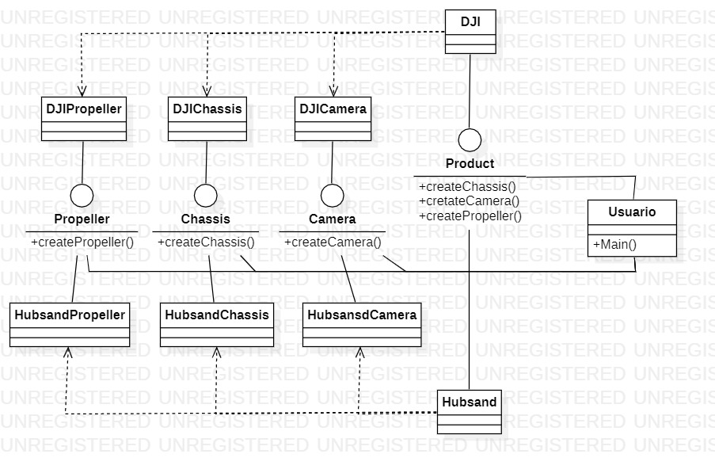

# **Abstract factory**

Es un patrón de diseño creacional que permite producir familias de objetos relacionados sin especificar sus clases concretas.

  - [**Problema**](#problema)
  - [**Solución**](#solución)
  - [**Ejemplo**](#ejemplo)
  - [**Aplicaciones**](#aplicaciones)
  - [**Pros**](#pros)
  - [**Contras**](#contras)
  - [**Relaciones con otros patrones**](#relaciones-con-otros-patrones)

## **Problema**

Imagina que estas creando un simulador de ceador de *drones*, El codigo consta de clases que representan:

1. Una familia de marcas relacionadas, por ejemplo: *DJI* y *Hubsand* 
2. Variantes de los componentes como lo pueden ser la camara, las helices y el chasis

Necesita una forma de crear objetos de *drones* individuales para que coincidan con otros objetos de la misma familia. Los clientes se enojan mucho cuando reciben piezas que no coinciden.

Además, no desea cambiar el código existente al agregar nuevos productos o familias de productos al programa. Los vendedores de *drones* actualizan sus catálogos muy a menudo, y no querrá cambiar el código principal cada vez que sucede.

## **Solución**

1. El patrón Abstract Factory sugiere declarar explícitamente interfaces para cada producto distinto de la familia de productos (por ejemplo, camara, chasis y helices). A continuación, puede hacer que todas las variantes de productos sigan esas interfaces. Por ejemplo, todas las variantes de camara pueden implementar la interfaz; todas las variantes de la chasis pueden implementar la interfaz, y así sucesivamente.

2. El siguiente paso es declarar la clase abstracta que es una interfaz con una lista de métodos de creación para todos los productos que forman parte de la familia de productos (por ejemplo,crear camara, crear chasis y crear helices). Estos métodos deben devolver tipos de productos abstractos representados por las interfaces que extrajimos anteriormente:helices, chasis, etc.

3. Ahora, ¿qué tal las variantes del producto? Para cada variante de una familia de productos, creamos una clase de fábrica independiente basada en la interfaz. Una fábrica es una clase que devuelve productos de un tipo determinado. Por ejemplo, *DJI* solo puede crear *ChassisDJI*, *CameraDJI* y *propellerDJI*.

El código de cliente tiene que trabajar con fábricas y productos a través de sus respectivas interfaces abstractas. Esto le permite cambiar el tipo de fábrica que se pasa al código de cliente, así como la variante de producto que recibe el código de cliente, sin interrumpir el código de cliente real.

Digamos que el cliente quiere una fábrica para producir una drone. El cliente no tiene que ser consciente de la clase de la fábrica, ni importa qué tipo de drone recibe. Ya sea un modelo DJI o una drone de *hubsand*, el cliente debe tratar todos los *drones* de la misma manera, utilizando la interfaz abstracta. Con este enfoque, lo único que el cliente sabe sobre el drone es que implementa el método de alguna manera. Además, cualquiera que sea la variante del drone que se devuelva, siempre coincidirá con el tipo de camara o chasis producido por el mismo objeto de fábrica.

Hay una cosa más que aclarar: si el cliente sólo está expuesto a las interfaces abstractas, ¿qué crea los objetos de fábrica reales? Normalmente, la aplicación crea un objeto de fábrica concreto en la etapa de inicialización. Justo antes de eso, la aplicación debe seleccionar el tipo de fábrica en función de la configuración o la configuración del entorno.

## **Ejemplo**

En este ejemplo se muestra cómo se puede usar el patrón de fábrica abstracta para crear elementos de *drones* sin acoplar el código de cliente a clases de interfaz de usuario concretas, manteniendo todos los elementos creados coherentes con un Drone seleccionado.

Se espera que los mismos elementos de interfaz de usuario de un drone se comporten de forma similar, pero se vean un poco diferentes en diferentes marcas. Además, es su trabajo asegurarse de que los elementos de la interfaz de usuario coinciden con el estilo del drone actual. No querrás que el programa represente partes DJI cuando se ejecute en *Hubsand*.

La interfaz *Abstract Factory* declara un conjunto de métodos de creación que el código de cliente puede usar para generar diferentes tipos de elementos de interfaz de usuario. Las fábricas de concretas corresponden a partes específicas y crean los elementos de interfaz de usuario que coinciden con ese drone en particular.

Funciona así: cuando se inicia una aplicación, comprueba el tipo del drone actual. La aplicación utiliza esta información para crear un objeto de fábrica a partir de una clase que coincida con el drone. El resto del código usa este generador para crear elementos de interfaz de usuario. Esto evita que se creen los elementos incorrectos.

Con este enfoque, el código de cliente no depende de clases concretas de generadores y elementos de interfaz de usuario, siempre y cuando funcione con estos objetos a través de sus interfaces abstractas. Esto también permite que el código de cliente admita otros generadores o elementos de interfaz de usuario que podría agregar en el futuro.

Como resultado, no es necesario modificar el código de cliente cada vez que agregue una nueva variación de elementos de interfaz de usuario a la aplicación. Sólo tiene que crear una nueva clase de fábrica que produce estos elementos y modificar ligeramente el código de inicialización de la aplicación para que seleccione esa clase cuando corresponda.

## **Aplicaciones**

Utilice *Abstract Factory* cuando el código necesite trabajar con varias familias de productos relacionados, pero no desea que dependa de las clases concretas de esos productos, es posible que se desconozcan de antemano o que simplemente desee permitir la extensibilidad futura.

 *Abstract Factory* proporciona una interfaz para crear objetos de cada clase de la familia de productos. Siempre que el código cree objetos a través de esta interfaz, no tiene que preocuparse por crear la variante incorrecta de un producto que no coincide con los productos ya creados por la aplicación.

Considere la posibilidad de implementar *Abstract Factory* cuando tenga una clase con un conjunto de métodos de fábrica que difuminen su responsabilidad principal.

En un programa bien diseñado cada clase es responsable sólo de una cosa. Cuando una clase se ocupa de varios tipos de productos, puede valer la pena extraer sus métodos de fábrica en una clase de fábrica independiente o una implementación de fábrica abstracta completa.

## **Pros**

- Puede estar seguro de que los productos que obtiene de una fábrica son compatibles entre sí.
  
- Evita el acoplamiento estrecho entre las clases concretas y el código de cliente.
  
- Principio de responsabilidad única. Puede extraer el código de creación del producto en un solo lugar, lo que facilita la compatibilidad con el código.
  
- Principio abierto/cerrado. Puede introducir nuevas variantes de productos sin romper el código de cliente existente.

## **Contras**

- El código puede volverse más complicado de lo que debería ser, ya que se introducen muchas interfaces y clases nuevas junto con el patrón.

## **Relaciones con otros patrones**

- Muchos diseños comienzan usando El método Factory y evolucionan hacia *Abstract Factory*, *Prototype* o *Builder*.

- *Builder* se centra en la construcción de objetos complejos paso a paso. *Abstract Factory* se especializa en la creación de familias de objetos relacionados. *Abstract Factory* devuelve el producto inmediatamente, mientras que *Builder* le permite ejecutar algunos pasos de construcción adicionales antes de capturar el producto.

- *Abstract Factory* a menudo se basan en un conjunto de métodos de fábrica,pero también puede usar *Prototype* para componer los métodos de estas clases.

- Puede servir como alternativa a *Facade* cuando solo desea ocultar la forma en que se crean los objetos del subsistema desde el código de cliente.

- Puede utilizar *Abstract Factory* junto con *Bridge*. Este emparejamiento es útil cuando algunas abstracciones definidas por *Bridge* solo pueden funcionar con implementaciones específicas. En este caso, *Abstract Factory* puede encapsular estas relaciones y ocultar la complejidad del código de cliente.

- Las *Abstract Factories*, los *Builders* y los *Prototype* se pueden implementar como *Singletons*.
